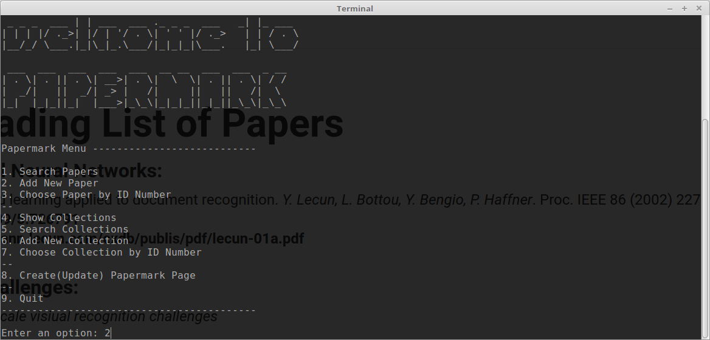
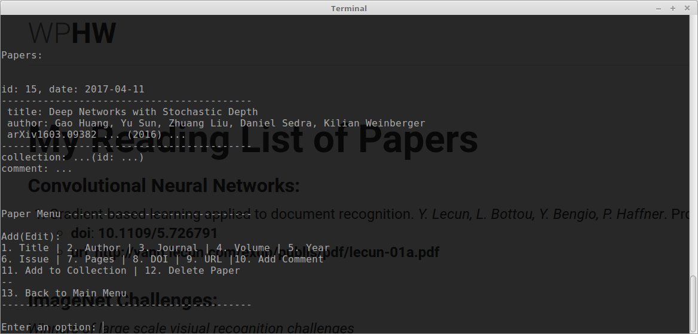

## A simple program to create and publish your reading list of academic papers.

Type `python menu.py` to run it, and here is what you can do with it:

- You can simply add papers and create collections for papers.

- Each paper added can be linked to only one collection (because i believe listing of the same paper for multiple times is not an efficient way for reperesenting a reading list).

- You can automatically add a paper by providing an arXiv URL (program uses arXiv API to get the information), or by providing a DOI (and this time program uses the API of [crossref.org](https://crossref.org/)):

- Finally you can update and create a ready to publish (markdown) page for your list (find it in the `./pages/` directory), and here is an example: [WPHW reading list](https://wphw.github.io/reading-list).

Feel free to use it.